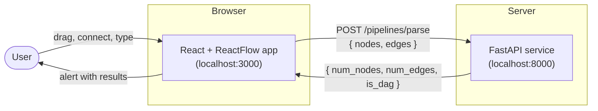
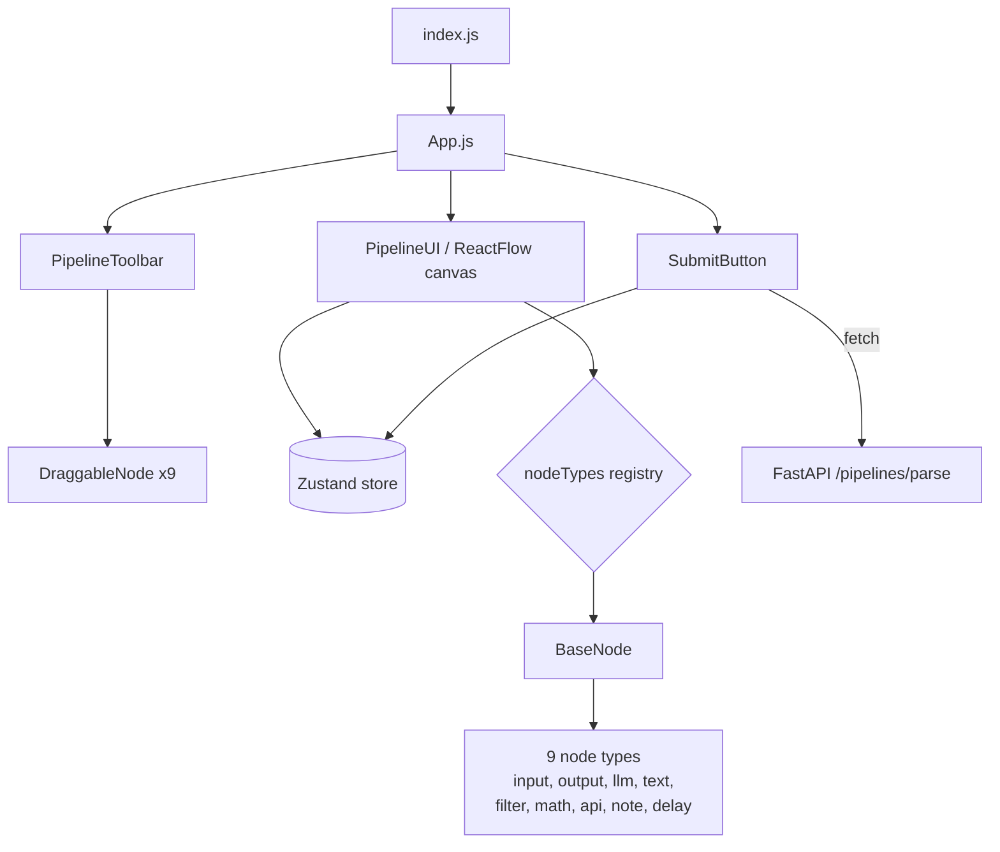
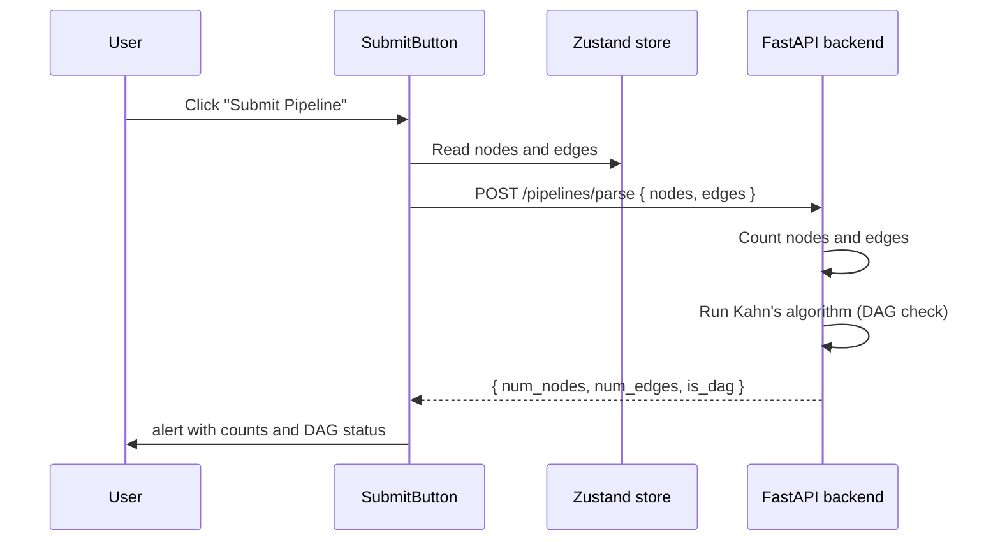

# High-Level Design (HLD)

This document describes the overall architecture of the pipeline builder: the
major components, how they interact, and the technology choices behind them.

## 1. System overview

The system has two independently runnable services:

- A React frontend that lets a user assemble a pipeline visually.
- A FastAPI backend that analyzes the assembled pipeline.

They communicate over a single HTTP endpoint.

## 2. Frontend component architecture

The frontend is a small, layered React application. A single Zustand store holds
all pipeline state; the UI components read from and write to it.

Key idea: every node type is rendered through one shared `BaseNode` component.
Adding a node does not require new layout, handle, or styling code.

## 3. Submit data flow

The end-to-end flow when the user clicks `Submit Pipeline`:

## 4. Technology choices

| Concern | Choice | Reason |
|---------|--------|--------|
| UI framework | React 18 | Required by the assessment; component model fits a node editor. |
| Graph canvas | ReactFlow 11 | Purpose-built for node-and-edge editors; provides handles, edges, panning, zoom, and minimap. |
| State management | Zustand | Lightweight global store already wired into the starter; avoids prop drilling between toolbar, canvas, and submit button. |
| Styling | Plain CSS with CSS variables | A single design system, no build-tool or library overhead, easy theming through an accent variable per node. |
| Backend framework | FastAPI | Required; concise request validation via Pydantic and automatic JSON handling. |
| Cross-origin access | CORS middleware | Lets the browser app call the API during local development. |

## 5. Design principles

- Configuration over duplication. Node behavior is declared as data and rendered
  by one component, so new nodes are cheap and consistent.
- Single source of truth. All pipeline state lives in the Zustand store; the
  submit step simply serializes it.
- Thin backend contract. The frontend sends raw ReactFlow nodes and edges; the
  backend tolerates extra fields and returns a small, fixed response shape.

## 6. Mapping to the assessment

| Part | Where it lives | HLD reference |
|------|----------------|---------------|
| 1. Node abstraction | `BaseNode` and `nodes/*` | Section 2 |
| 2. Styling | `index.css` design system | Section 4 |
| 3. Text node logic | `textNode.js` | See LLD, variable handling |
| 4. Backend integration | `submit.js`, `main.py` | Sections 1 and 3 |

For component internals, schemas, and algorithms, see [lld.md](lld.md).
