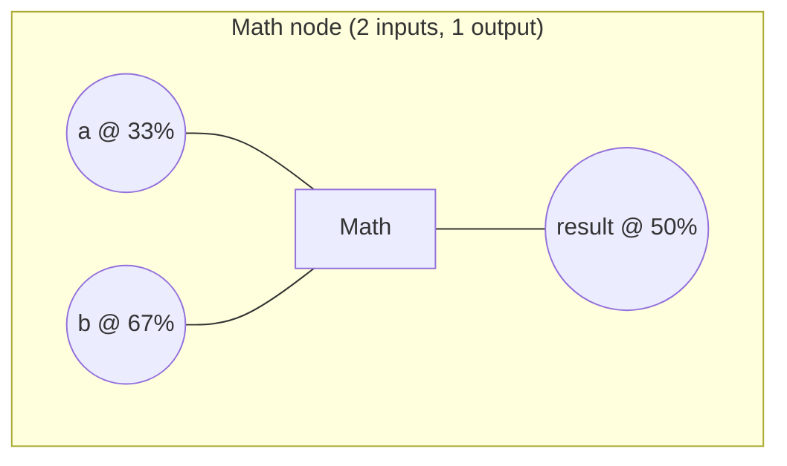
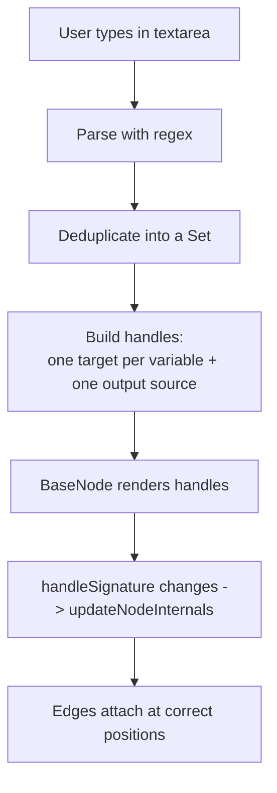
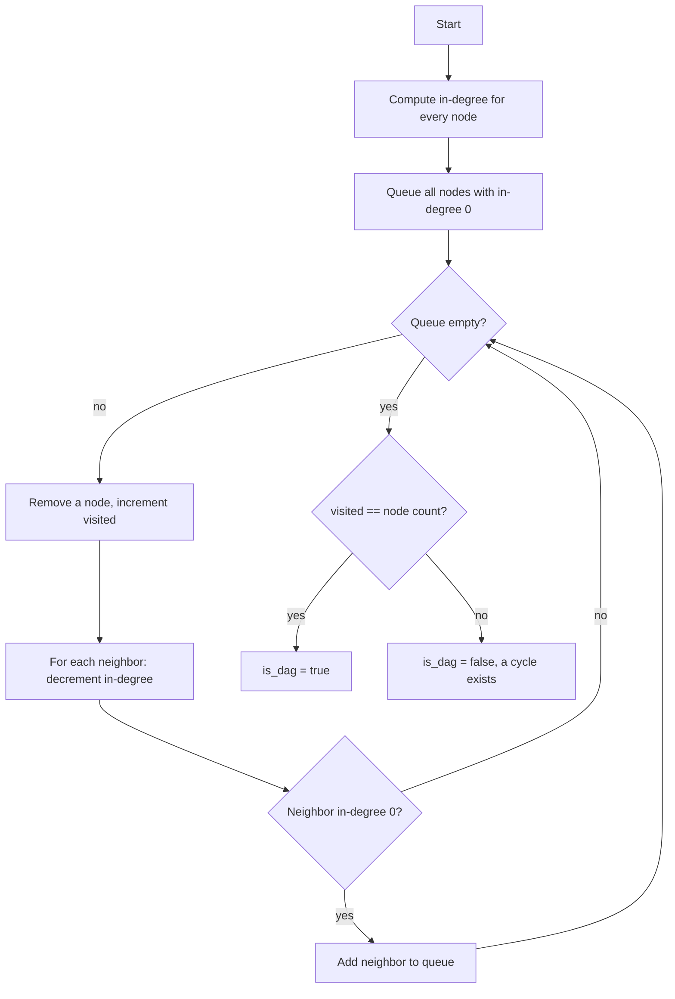

# Low-Level Design (LLD)

This document covers the internals: the node-config schema, the handle layout
math, the Text node's variable logic, the Zustand store API, the backend data
models, and the DAG algorithm.

## 1. BaseNode

`BaseNode` is the single component every node renders through. A node supplies a
configuration; `BaseNode` produces the header, the fields, and the handles.

### 1.1 Props

| Prop | Type | Description |
|------|------|-------------|
| `id` | string | The node ID assigned by the store. |
| `data` | object | Saved node data; used to initialize field values. |
| `title` | string | Header label. |
| `icon` | string | Optional header glyph. |
| `accent` | string | Theme color; drives the header and handle colors via a CSS variable. |
| `fields` | Field[] | Declarative form fields (see 1.2). |
| `handles` | Handle[] | Connection points (see 1.3). |
| `children` | node | Optional custom body (the Text node uses this). |
| `style` | object | Optional inline overrides (the Text node sets a dynamic width). |

### 1.2 Field schema

Each entry in `fields` describes one labeled input. `BaseNode` keeps field state
locally and mirrors every change into the store via `updateNodeField`.

| Key | Type | Description |
|-----|------|-------------|
| `name` | string | Field key; also the key written to node data. |
| `label` | string | Display label (omit or empty for no label). |
| `type` | `text` \| `number` \| `select` \| `textarea` | Control to render. Defaults to `text`. |
| `options` | string[] | Choices, required when `type` is `select`. |
| `default` | string \| function | Initial value. A function receives the node `id`, enabling defaults such as `input_1`. |

### 1.3 Handle schema

Each entry in `handles` describes one connection point.

| Key | Type | Description |
|-----|------|-------------|
| `type` | `source` \| `target` | `source` is an output, `target` is an input. |
| `position` | `left` \| `right` \| `top` \| `bottom` | Which side the handle sits on. |
| `id` | string | Handle ID; the rendered DOM ID becomes `${nodeId}-${id}`. |
| `style` | object | Optional per-handle style overrides. |

### 1.4 Handle spacing

Handles are grouped by side and spaced evenly so they never overlap, regardless
of count. For handle index `i` (zero-based) within a side of `n` handles, the
vertical offset is:

```
top = (i + 1) / (n + 1) * 100%
```



| Inputs on a side | Offsets |
|------------------|---------|
| 1 | 50% |
| 2 | 33%, 67% |
| 3 | 25%, 50%, 75% |

### 1.5 Re-measuring handles

ReactFlow caches each node's handle geometry. When a node's handle set changes at
runtime (the Text node adding or removing a variable handle), the cache must be
invalidated or edges can attach to stale positions. `BaseNode` computes a
signature string from the current handles and calls `useUpdateNodeInternals(id)`
whenever that signature changes.

```
handleSignature = handles.map(h => `${h.type}:${h.position}:${h.id}`).join('|')
useEffect(() => updateNodeInternals(id), [id, handleSignature])
```

## 2. Zustand store

A single store in `store.js` holds all pipeline state.

| Member | Kind | Description |
|--------|------|-------------|
| `nodes` | state | Array of ReactFlow nodes. |
| `edges` | state | Array of ReactFlow edges. |
| `getNodeID(type)` | action | Returns the next unique ID for a type, for example `math-1`. |
| `addNode(node)` | action | Appends a node. |
| `onNodesChange(changes)` | action | Applies ReactFlow node changes (move, select, remove). |
| `onEdgesChange(changes)` | action | Applies ReactFlow edge changes. |
| `onConnect(connection)` | action | Adds an edge for a new connection. |
| `updateNodeField(id, field, value)` | action | Updates a single field on a node's data. |

Deletion is handled by ReactFlow's built-in remove changes flowing through
`onNodesChange` and `onEdgesChange`; selecting an element and pressing
`Backspace` or `Delete` removes it.

## 3. Text node logic (Part 3)

The Text node is the one node with custom body content. It owns its text state
and derives both its size and its handles from that text.

### 3.1 Variable parsing

Variables are tokens of the form `{{ name }}` where `name` is a valid JavaScript
identifier. The matching rules:

| Rule | Pattern fragment |
|------|------------------|
| First character | letter, underscore, or dollar sign: `[a-zA-Z_$]` |
| Following characters | letters, digits, underscore, dollar: `[a-zA-Z0-9_$]*` |
| Surrounding braces | double braces, inner whitespace ignored: `\{\{\s*...\s*\}\}` |

The full expression is `/\{\{\s*([a-zA-Z_$][a-zA-Z0-9_$]*)\s*\}\}/g`. Matches are
collected into a `Set`, so repeated references to the same variable produce a
single handle.

### 3.2 From text to handles



| Input text | Left handles created |
|------------|----------------------|
| `{{ input }}` | `input` |
| `{{ a }} {{ b }}` | `a`, `b` |
| `{{ a }} {{ a }}` | `a` (deduplicated) |
| `{{ 1bad }}` | none (invalid identifier) |
| `{{ }}` | none (empty) |

### 3.3 Auto-resize

| Dimension | Mechanism |
|-----------|-----------|
| Height | On each change the textarea height is reset to `auto` then set to its `scrollHeight`, so it grows to fit wrapped lines. |
| Width | The node width is derived from the longest line: `clamp(longestLine * 8 + 48, 220, 460)` pixels. |

## 4. Backend (Part 4)

### 4.1 Data models

Pydantic models validate the request. Extra fields sent by ReactFlow are allowed
and ignored.

| Model | Required fields | Notes |
|-------|-----------------|-------|
| `Node` | `id` | Other ReactFlow fields permitted and ignored. |
| `Edge` | `source`, `target` | Other fields permitted and ignored. |
| `Pipeline` | `nodes`, `edges` | The request body. |

### 4.2 Response

| Field | Type | Description |
|-------|------|-------------|
| `num_nodes` | int | `len(nodes)` |
| `num_edges` | int | `len(edges)` |
| `is_dag` | bool | Result of the cycle check. |

### 4.3 DAG detection (Kahn's algorithm)



Worked examples:

| Nodes | Edges | Visited | Result |
|-------|-------|---------|--------|
| a, b, c | a->b, b->c | 3 of 3 | `is_dag = true` |
| a, b, c | a->b, b->c, c->a | 0 of 3 | `is_dag = false` |
| (none) | (none) | 0 of 0 | `is_dag = true` (trivially acyclic) |

Edges that reference unknown node IDs are skipped while building the graph, so
malformed input cannot raise an error. Time and space complexity are both
`O(V + E)`.

## 5. Extension checklist

Adding a node touches three small places and no shared logic:

| Step | File |
|------|------|
| Define the component (config for `BaseNode`) | `src/nodes/<name>.js` |
| Register the type | `src/ui.js` (`nodeTypes`) |
| Add to the palette | `src/toolbar.js` |
